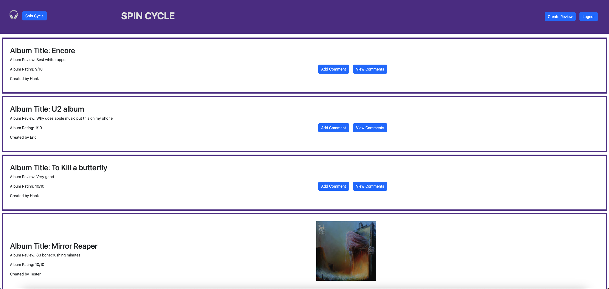

# Spin Cycle

  
  
    

  ## Table of Contents

  * [Description](#description)
  * [Installation](#installation)
  * [Usage](#usage)
  * [MIT](https://choosealicense.com/licenses/MIT)
  * [Contributing](#contributing)
  * [Tests](#tests)
  * [Questions](#questions)
  
  ## [Description](#table-of-contents)

  Spin Cycle is an application designed to allow users to review and rate music albums and share with the rest of the world. Users are also able to comment on other users' reviews to engage in friendly debate. 

  ## [Installation](#table-of-contents)

  N/A
  
  ## [Usage](#table-of-contents)

  Create an account using the signup option. Once signed up you will be taken to the homepage. If you already have an account, simply login to be taken to the homepage. From here you can read previous reviews or click on the labeled link to have the option to create a review of your own. 

  

  [Heroku Link Here](https://spin-cycle.herokuapp.com)

  ## [License](#table-of-contents)

  
    
  The application is covered under the following license:
    
    
  [MIT](https://choosealicense.com/licenses/MIT)
    
    

  ## [Contributing](#table-of-contents)

  Eric Tranchell, Griffon Dean, Hank Richter, and Jeff Montagne all contributed to the development of this project.  

  ## [Tests](#table-of-contents)

  API routes tested using Insomnia.

  ## [Questions](#table-of-contents)

  Please contact us using the following links:

  [Jeff Montagne](https://github.com/Tagne13), [Hank Richter](https://github.com/HankRichter), [Eric Tranchell](https://github.com/etranchell), [Griffon Dean](https://github.com/griffdean)

  [Email: Tagne13@gmail.com](mailto:Tagne13@gmail.com),
  [hankrichter97@gmail.com](mailto:hankrichter97@gmail.com), [erictranchell@yahoo.com](mailto:erictranchell@yahoo.com), [grdean14@gmail.com](mailto:grdean14@gmail.com),
